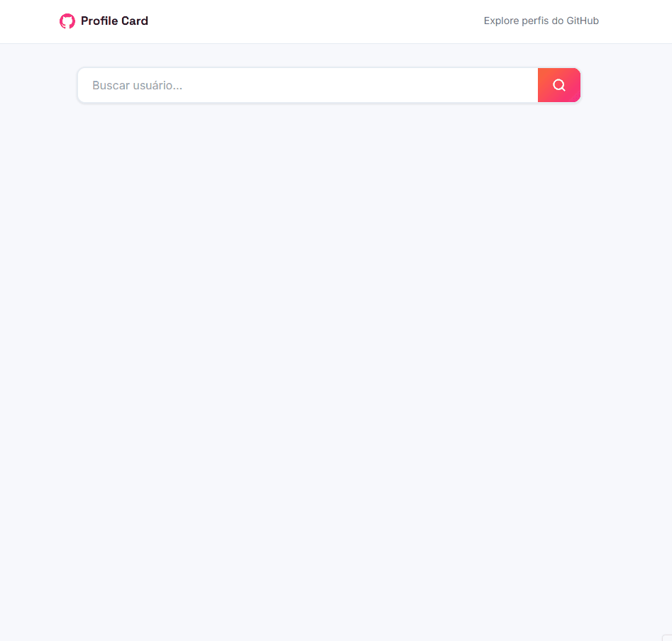

# GitHub Profile Card 🔎

Aplicação web que consome a API pública do GitHub para buscar e exibir perfis de usuários em tempo real, com foco em experiência do usuário e boas práticas de desenvolvimento front-end.

---

## 🖼️ Preview

---

## 🌐 Deploy

🔗 **Acesse online:**
[Ver projeto funcionando](https://aline-mmiranda.github.io/project-fetch-github-api/)

---

## ✨ Funcionalidades

### 👤 Perfil do usuário
- Foto, nome, @login e bio
- Localização, empresa e site pessoal
- Contagem de repositórios, seguidores e seguindo

### 📦 Repositórios recentes
- Grid com os 6 repositórios mais recentes
- Linguagem principal com color dot
- Contagem de estrelas e forks

### 🎨 Experiência do usuário
- **Loading skeleton** animado enquanto a API responde
- **3 estados de erro** distintos: usuário não encontrado, limite de requisições e erro de conexão
- **Histórico de buscas** com localStorage — últimas 5 buscas salvas como pills clicáveis
- Layout responsivo com colapso para mobile

---

## 🧠 Desafios Técnicos

- Requisições paralelas com `Promise.all` para buscar perfil e repositórios simultaneamente
- Skeleton loading sincronizado com o layout real do card
- Persistência do histórico de buscas entre sessões com localStorage
- Tratamento diferenciado por tipo de erro (404, 403, falha de rede)
- Mapa de cores por linguagem de programação para os language dots

---

## 🛠️ Tecnologias

- HTML5
- CSS3 (custom properties, CSS Grid, animações)
- JavaScript ES6+ (async/await, Promise.all, localStorage)
- GitHub REST API

---

## 📊 Competências Demonstradas

✔ Consumo de API REST com Fetch  
✔ Programação assíncrona com `async/await` e `Promise.all`  
✔ Persistência de dados com localStorage  
✔ Manipulação dinâmica do DOM  
✔ Gerenciamento de múltiplos estados de UI (loading, erro, vazio, resultado)  
✔ CSS Grid responsivo  
✔ Design de produto com identidade visual própria  

---

## ✨ Autora

**Aline M Miranda**
Desenvolvedora Front-End em transição de carreira

